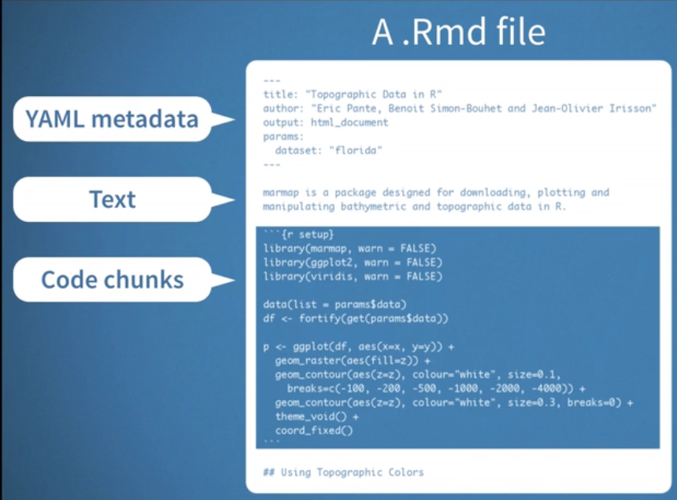

# Week09 Data Wrangling Exercises & R Markdown (Lite) Ch 7,9

###  No assignments were due today

___

## Computer Preparation

You are expected to start this lecture with R Studio open with a fresh and empty text document in the upper left panel and a clean environment.

### *_GENERAL COMPUTER SETUP (SHOULD ALREADY BE DONE)_* 

<details><summary>Tidyverse Install</summary>
<p>
```R
# clear all variables from environment
rm(list = ls())
```

```
# RUN THE FOLLOWING LINE IN THE CONSOLE (LOWER LEFT PANEL)
install.packages("tidyverse")

# ADD THE FOLLOWING LINE TO YOUR TEXT DOCUMENT (UPPER LEFT PANEL), THEN EXECUTE IT (CTRL-ENTER)
library(tidyverse)
```

</p>
</details>

<details><summary>Win10</summary>
<p>

  * If the Ubuntu app is not installed, then follow [these instructions](https://github.com/cbirdlab/wlsUBUNTU_settings/blob/master/InstallLinuxOnWindows_Automated.pdf)
  
  * Log into your Ubuntu terminal.  _We will not use `gitbash` unless you can not get Ubuntu running._ After logging in, You are in your home directory. 
  
  * If you are using an Ubuntu terminal that has not been setup (you will know because it will ask you to create a new user name and password) or you notice odd cursor behavior when editing text in the terminal, then run the following code:
  
    ```bash
    git clone https://github.com/cbirdlab/wlsUBUNTU_settings.git
    . ./wlsUBUNTU_settings/updateSettings.bash
    rm -rf wlsUBUNTU_settings
    ```
    
  * If the `CSB` directory does not exist in your home directory (check with `ls`), then run the following code to clone the `CSB` repository into your home directory:
  
    ```bash
    git clone https://github.com/CSB-book/CSB.git
    ```

  * It is always a good idea to keep your apps in `Ubuntu` up to date. _The first time you do this, it could take a long time to finish. After that, if you do this when you log in, it should go quickly._
    ```bash
    sudo apt update
    sudo apt upgrade
    ```

#### Install `R` and `R Studio`

If you have a windows computer, you will need to separately install `R` in the windows environment even if you already installed it in Ubuntu.  Go to the following link below, download R for Windows and run the installer as you would for any other windows app.  

*If you installed R a while ago (more than a month ago), you should do it again or else problems will start to crop up*

1. [R Install](https://cran.revolutionanalytics.com/)

Regardless of your operating system, if you have not already installed R studio, you need to do that now.  On windows computers, install R studio in Windows.  

*If you installed R Studio a while ago, you should do it again to upate to the latest version.*

2. [RStudio Install](https://rstudio.com/products/rstudio/download/?utm_source=downloadrstudio&utm_medium=Site&utm_campaign=home-hero-cta#download)


#### Clone CSB Repo to Your Windows Home Dir

Just to make things a little more tricky, if you have windows, you cannot access the `CSB` repo that you cloned to your home directory in ubuntu with R Studio. So, we have to clone the repo again, but this time to your windows home dir (at least what R Studio recognizes as your windows home dir, `Documents`).

Open your ubuntu terminal and navigate to your windows `Documents` directory, then clone the CSB repo to there.

```bash
# make sure you are in ubuntu
cd /mnt/c/Users/YourWinUserName/Documents 
git clone https://github.com/CSB-book/CSB.git
```

</p>
</details>

<details><summary>MacOS</summary>
<p>
 
  * Open a terminal window
  
  * Consider installing [homebrew](https://brew.sh/).  You will be able to use homebrew to install linux software, such as `tree`, which is used in the slide show.
  
  * If the `CSB` directory does not exist in your home directory (check with `ls`), then run the following code to clone the `CSB` repository into your home directory:
  
    ```bash
    git clone https://github.com/CSB-book/CSB.git
    ```

#### Install `R` and `R Studio`

If you have a Mac and you already installed `R` for use in your terminal, you do not need to reinstall it.

*If you installed R a while ago (more than a month ago), you should do it again or else problems will start to crop up*

1. [R Install](https://cran.revolutionanalytics.com/)

Regardless of your operating system, if you have not already installed R studio, you need to do that now. 

*If you installed R Studio a while ago, you should do it again to upate to the latest version.*

2. [RStudio Install](https://rstudio.com/products/rstudio/download/?utm_source=downloadrstudio&utm_medium=Site&utm_campaign=home-hero-cta#download)


</p>
</details>

### *_ADDITIONAL COMPUTER SETUP (NEW FOR TODAY)_* 

R Markdown is a typesetting language that allows you to also incorporate R code chunks.  If you did not notice yet, the solutions for the Data Wrangling chapter are written in R Markdown.  There are a variety of applications of R Markdown.  The one I have used the most is making a report where the data changes through time, but the layout of figures and text does not change.

1. For R Markdown to work properly, you need some additional packages installed in R Studio. Realize that R can also process R Markdown scripts from terminal without R Studio.

```r 
install.packages("rmarkdown")
install.packages("knitr", dependencies=TRUE)
```

2. You should also install `pandoc` on your computer following the instructions [here](https://pandoc.org/installing.html).

3. Finally, you should install scientific typesetting software `LaTeX` that operates independently of R and RStudio. Like `Linux`, there are several flavors of `LaTeX`.  Follow the instructions [here](http://computingskillsforbiologists.com/setup/scientific-typesetting/).  

> For Windows, after running the setup.exe file, you have to click install on the `MiKTeX` and `TeXstudio` buttons.  The install takes a while, just let it run in the background and check on it periodically until it is done.

---


## I. R Markdown

R Markdown has a very nice lesson plan that we will use to review its features.  We will link to the lesson below and then work within the R Markdown website. You will work in R Studio

### [Lesson 1](https://rmarkdown.rstudio.com/lesson-1.html)

### Creating an R Markdown Document

In R Studio, open a new R Markdown document

* name it `lesson-1`

* use default settings

If you were successful, your document will already be populated with several lines of text and code.



### YAML Header

Lines 1-4


## II. Exercise 9.8.1


---

## II. Exercise 9.8.2


---

## III. Exercise 9.8.3
